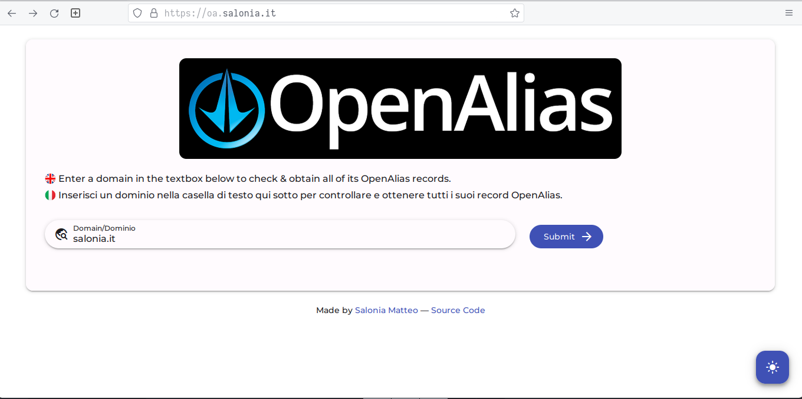
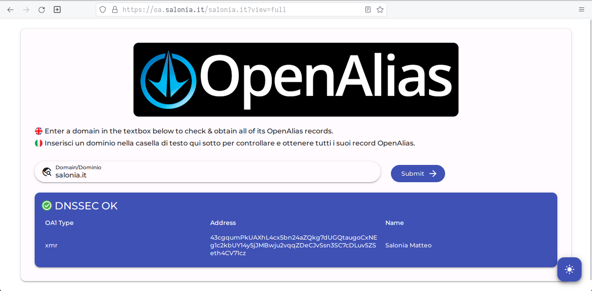

# OpenAlias API WebForm
Improved OpenAlias API WebForm, based on existing work from [openalias/openalias-api](https://github.com/openalias/openalias-api).

## Requirements
- php
- redis (optional but recommended, used to cache requests)

Also, you need to be running on a UNIX environment that allows use of the `host` command (to check RRSIG keys).

## Installation
Clone this repository:

`git clone https://github.com/saloniamatteo/openalias`

After that, modify `config.ini` to set redis location and port; by default it's set to `localhost` and port `6379`.

If you want to cache with Redis, you won't have to do anything, as it's enabled by default.
However, if you DO NOT want to use Redis, then modify `index.php`, and modify the file as follows:

```php
/* Uncomment this line if you DON'T want to use Redis */
$Routes = new Routes($app);

/* Uncomment these lines if you want to use Redis */
//$Redis = new Redis();
//$Routes = new Routes($app, $Redis);
```

You can also enable/disable logging (disabled by default):

```php
/* Set logging options for debugging, comment if using in production */
$app->log->setEnabled(true);
$app->log->setLevel(\Slim\Log::DEBUG);
```

After all of this, you'll be good to go.

## Setting up with Nginx

I recommend you use nginx, because it's fast and simple to use, however you can use Apache or any other Web Server.

Create a file under `/etc/nginx/sites-enabled`, for example `/etc/nginx/sites-enabled/openalias`:

```nginx
server {
	# NOTE: replace 'oa.example.com' with your domain
	# For example, I use 'oa.salonia.it'
	listen 80;
	server_name oa.example.com;

	# NOTE: replace '/var/www/oa' with the location of this directory
	root /var/www/oa;
	index index.php;

	location / {
		# This is cool because no php is touched for static content.
		try_files $uri $uri/ /index.php;
	}

	location ~ [^/]\.php(/|$) {
		fastcgi_split_path_info ^(.+?\.php)(/.*)$;
		if (!-f $document_root$fastcgi_script_name) {
			return 404;
		}

		# Mitigate https://httpoxy.org/ vulnerabilities
		# NOTE: here we use '127.0.0.1:9000' for PHP FastCGI,
		# replace it if you use a different port number, or if you use UNIX sockets
		fastcgi_param HTTP_PROXY "";
		fastcgi_pass 127.0.0.1:9000;

		fastcgi_param   SCRIPT_FILENAME    $document_root$fastcgi_script_name;
		fastcgi_param   SCRIPT_NAME        $fastcgi_script_name;
		include fastcgi.conf;
	}
}
```

## Usage

After you configured nginx, or a Web Server of your choice, you're ready to run OpenAlias.

If you configured it like the example above, navigate to `oa.example.com` (obviously, replace it with your domain name).
After, you'll see an interface like this one:



After entering a domain name and hitting "Submit", you should see something like this:



Notice the page will also tell you if the domain's DNSSEC is verified or not.

Normally, the website will show human-readable results (of course), however, you can also get JSON results directly, simply by removing the `view=full` GET parameter from the URL, that way you can easily parse the JSON response:


URLs:

- `https://oa.salonia.it/salonia.it?view=full` -> Human readable results
- `https://oa.salonia.it/salonia.it`           -> Results in JSON
