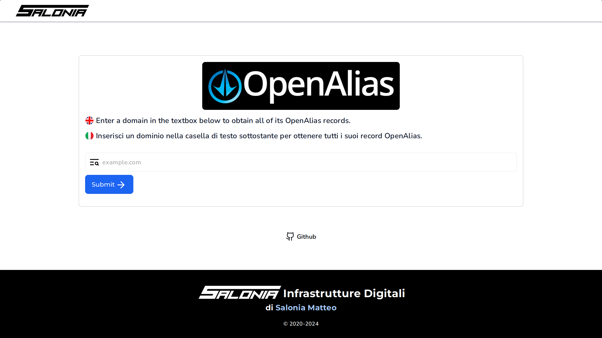
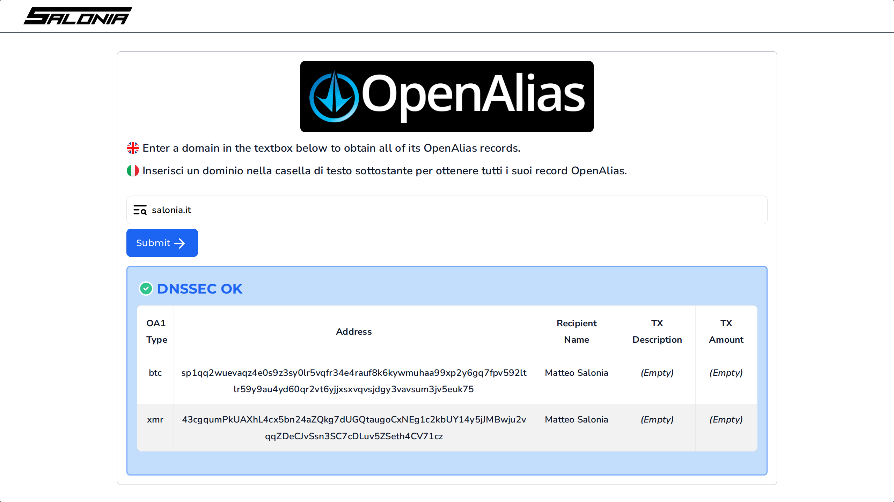
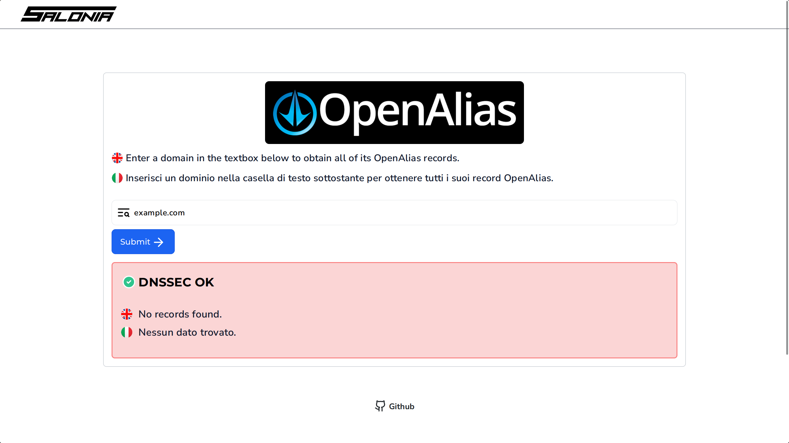

# [OpenAlias WebUI](https://oa.salonia.it)
OpenAlias web portal to easily retrieve OpenAlias records of any domain.

This website is built in **PHP** with the following:
- **Backend**: [Laravel](https://laravel.com)
- **Bundler**: [Vite](https://vite.dev) + [PurgeCSS](https://purgecss.com)

The following are used for the front-end:
- **Framework**: [CirrusUI](https://cirrus-ui.com)
- **Icons**: [Lucide](https://lucide.dev)

## Donate
Support this project: [salonia.it/donate](https://salonia.it/donate)

## Screenshots
Landing page:


Page with results:


Page with no results:


## Features
### DNSSEC validation
Each requested domain is checked for presence of `RRSIG` records,
which confirm DNSSEC validity.

The validation is done with the following command: `host -t RRSIG <domain>`,
where `<domain>` corresponds to the requested domain, already sanitized.

The results are then displayed on top of the records table,
showing a white check mark on a green background (✅),
or a white cross on a red background (❎),
followed, respectively, by **DNSSEC OK**, or **DNSSEC FAIL**.

### AbuseIPDB
This Middleware, written by me, checks if the incoming IP address comes from
a "bad" server (crawlers, scanners, etc.), thanks to
[AbuseIPDB](https://www.abuseipdb.com/faq.html)'s `/check` API endpoint.

When a request is received, the `BlockRequest` Middleware will check the cache,
using the incoming IP as key. If a record is found, check if it is a good IP:
if it is, proceed with the request. If it isn't, throw a `403`, which will be
rendered with a pretty page, regardless.

If no records are found in the cache, `BlockRequest` queries AbuseIPDB,
honoring the user-provided options (see below). If the IP address is
whitelisted, check if the user wants to ignore this whitelist;
we then check the IP score and, if it is above a certain threshold,
the request will be blocked, like the case above, throwing a `403`.

To use this, create an account, then head over to [AbuseIPDB/api](https://www.abuseipdb.com/account/api)
and create an APIv2 key. Save this key into the `.env` file:

```env
# If you want to block incoming requests from bad servers
# using AbuseIPDB, enter your API key here.
ABUSEIPDB_KEY= # Your API key goes here!
```

You're all set! Make sure the cache store is also properly configured.
The cache store provided with this site is `file`, so you should be good.

Additionally, you can tune the following parameters:
- `ABUSEIPDB_THRESHOLD`: The minimum percentage score required
                         for an IP to be considered malicious. Default: `35`.
- `ABUSEIPDB_IGNORE_WHITELIST`: Ignore AbuseIPDB's whitelist preference
                                for every IP. Default: `0`.
- `ABUSEIPDB_CACHE_TTL`: Store the results in cache for x minutes. Default: `15`
- `ABUSEIPDB_IP_OK`: Store this string for a known good IP. Default: `OK`
- `ABUSEIPDB_IP_BAD`: Store this string for a known bad IP. Default: `BAD`

### Rate limiter
Apart from the AbuseIPDB integration, this website uses Laravel's
[rate limiter](https://laravel.com/docs/11.x/rate-limiting).
It uses the same `CACHE_STORE` driver as the AbuseIPDB integration,
which defaults to `file`.

The rate limiter is defined in `app/Providers/AppServiceProvider.php` as follows:

```php
/* Bootstrap any application services. */
public function boot()
{
	// Limit to 5 requests per minute.
	RateLimiter::for('global', function (Request $request) {
		if (config('APP_ENV') == 'production') {
			return Limit::perMinute(5)->by($request->ip());
		}
	});
}
```

It is configured to allow a maximum of **5 page requests per minute**,
before throwing an HTTP 429 (Too many requests).

### Asset bundling
Assets are bundled and handled by Vite:
- CSS & JS files are minified (PostCSS and PurgeCSS) and versioned
- Images are versioned

This helps with removing unused code, lowering asset size, and lowering page load times.

Run `npm run build` to re-generate the asset bundle.

### Components
Most HTML components (Card, Hero, Tile, etc.) are split up in several files, under `resources/views/components/`.
This makes it way easier and faster to write new pages, thanks to Blade Templates.

### Caching
Config, events, views, and routes are cached, making site load-times faster.

Run `composer cache` to cache them.

### Minification
Every page is minified. Laravel does not do this by default, and there does not
seem to be a "standard" way to do it, other than downloading some shady package.

I've implemented my own simple HTML minifier, making use of PHP's output buffering.

Additionally, CSS & JS files are minified by PurgeCSS and Vite, respectively.

## Dependencies
To deploy this website, you need the following:
- `php`
- `composer`
- `nodejs` with `npm`

## Setup
- Clone the repo: `git clone https://github.com/saloniamatteo/openalias`
- Change directory: `cd openalias`
- Install PHP dependencies: `composer install`
- Install node dependencies: `npm i`
- Generate `APP_KEY`: `php artisan key:generate`

If you want to deploy the website locally, make sure you modify `.env`,
and uncomment the following:

```env
# Uncomment these values if running in production
APP_ENV=local
APP_DEBUG=true
APP_URL="http://localhost"
```

The website can now be deployed using the built-in webserver, `php artisan serve`:
it will be reachable at `localhost` on port `8000`.

If you want to use the built-in webserver, make sure you set `APP_URL` to your website's URL.

If you want to serve this website to the Internet, please make sure you don't use
`php spark serve`, and rather have a real server.
I use [nginx](https://nginx.org) with [FastCGI](https://nginx.org/en/docs/http/ngx_http_fastcgi_module.html).

Make sure you also disable access to `/build/assets/manifest.json`!

### Assets
Make sure you bundle the assets used in the website (CSS, fonts, images):

```sh
npm run build
```

### Cache
When running in production, it is recommended to cache PHP assets with the following command:

```sh
composer cache
```

This will cache PHP config, events, routes, views.

### Sample nginx config
Note: this config makes the following assumptions:
- Your site is hosted at `oa.example.com`
- You use LetsEncrypt (`certbot`) and have deployed an SSL certificate
- Your `nginx` build supports HTTP2 and HTTP3 (QUIC)
- You have IPv6 support enabled
- You use port 80 for HTTP and port 443 for HTTPS
- You use php-fpm (FastCGI) and call it via `/var/run/php-fpm.sock`
- You want to disable client uploads
- You want to redirect every HTTP request to the HTTPS port
- You want to allow `robots.txt`
- You want to disable `.well-known`

Make sure you movify everything that says "Change this"!

```nginx
server {
	# HTTP/1.1 & HTTP/2
	listen 443 ssl;
	listen [::]:443 ssl;

	# HTTP/3 (QUIC)
	listen 443 quic;
	listen [::]:443 quic;

	# Change this!
	server_name oa.example.com;

	# If the host isn't oa.example.com, redirect the client
	# Change this!
	if ($host != oa.example.com) {
		return 301 https://oa.example.com$request_uri;
	}

	# HTTP2/3
	http2 on;
	http3 on;
	quic_gso on;
	quic_retry on;
	ssl_early_data on;

	# SSL
	ssl_stapling on;
	ssl_stapling_verify on;
	include /etc/letsencrypt/options-ssl-nginx.conf;
	ssl_certificate /path/to/fullchain.pem; # Change this!
	ssl_certificate_key /path/to/privkey.pem; # Change this!
	ssl_dhparam /etc/letsencrypt/ssl-dhparams.pem;

	# Site root. Change this!
	root /var/www/oa.example.com/public;

	# Prevent nginx HTTP Server Detection
	server_tokens off;

	# Only allow GET requests
	if ($request_method !~* ^GET$) {
		return 405;
	}

	# Disable uploads
	client_max_body_size 0;
	client_body_timeout 0s;
	fastcgi_buffers 64 4K;

	# The settings allows you to optimize the HTTP2 bandwidth.
	# See https://blog.cloudflare.com/delivering-http-2-upload-speed-improvements for tuning hints
	client_body_buffer_size 512k;

	# Specify how to handle directories -- specifying `/index.php$request_uri`
	# here as the fallback means that Nginx always exhibits the desired behaviour
	# when a client requests a path that corresponds to a directory that exists
	# on the server. In particular, if that directory contains an index.php file,
	# that file is correctly served; if it doesn't, then the request is passed to
	# the front-end controller. This consistent behaviour means that we don't need
	# to specify custom rules for certain paths (e.g. images and other assets,
	# `/updater`, `/ocm-provider`, `/ocs-provider`), and thus
	# `try_files $uri $uri/ /index.php$request_uri`
	# always provides the desired behaviour.
	index index.php index.html /index.php$request_uri;

	# Allow robots.txt
	location = /robots.txt {
		allow all;
		log_not_found off;
	}

	# Disable .well-known
	location ~ /\.(?!well-known).* {
		log_not_found off;
		deny all;
	}

	# Hide certain paths from clients
	location ~ ^/(?:3rdparty|config|data|lib|manifest.json|templates|tests)(?:$|/) { return 404; }
	location ~ ^/(?:\.|autotest|console|db_|indie|issue|occ) { return 404; }

	# Prepend all requests with "/index.php" -- this acts as our front controller.
	# index.php handles all requests, but we have to hide it.
	# The line below allows us to do exactly what we want.
	location / {
		rewrite ^ /index.php;
	}

	# Ensure this block, which passes PHP files to the PHP process, is above the blocks
	# which handle static assets (as seen below). If this block is not declared first,
	# then Nginx will encounter an infinite rewriting loop when it prepends `/index.php`
	# to the URI, resulting in a HTTP 500 error response.
	location ~ \.php(?:$|/) {
		fastcgi_split_path_info ^(.+?\.php)(/.*)$;
		set $path_info $fastcgi_path_info;

		# Try to load requested file. If it doesn't exist, instead
		# of throwing a 404, load the front controller, where
		# we can load a pretty 404 page.
		try_files $fastcgi_script_name /index.php/$fastcgi_script_name;

		include fastcgi_params;
		fastcgi_param SCRIPT_FILENAME $realpath_root$fastcgi_script_name;
		fastcgi_param PATH_INFO $path_info;
		fastcgi_param HTTPS on;

		fastcgi_param modHeadersAvailable true;		 # Avoid sending the security headers twice
		fastcgi_param front_controller_active true;	 # Enable pretty urls
		fastcgi_pass unix:/var/run/php-fpm.sock;

		fastcgi_intercept_errors on;
		fastcgi_request_buffering off;
		fastcgi_max_temp_file_size 0;

		# Remove X-Powered-By, which is an information leak
		fastcgi_hide_header X-Powered-By;

		# Do not show ratelimit
		fastcgi_hide_header X-Ratelimit-Limit;
		fastcgi_hide_header X-Ratelimit-Remaining;

		# Inform clients that HTTP3 is available
		add_header Alt-Svc 'h3=":443"; ma=86400';

		# COOP/COEP. Disable if you use external plugins/images/assets
		add_header Cross-Origin-Opener-Policy "same-origin" always;
		add_header Cross-Origin-Embedder-Policy "require-corp" always;
		add_header Cross-Origin-Resource-Policy "same-origin" always;

		# HSTS
		add_header Strict-Transport-Security "max-age=31536000; includeSubDomains; preload" always;

		# HTTP response headers borrowed from Nextcloud `.htaccess`
		add_header Referrer-Policy "no-referrer";
		add_header X-Content-Type-Options "nosniff";
		add_header X-Download-Options "noopen";
		add_header X-Frame-Options "SAMEORIGIN";
		add_header X-Permitted-Cross-Domain-Policies "none";
		add_header X-XSS-Protection "1; mode=block";

		# Tell browsers to use per-origin process isolation
		add_header Origin-Agent-Cluster "?1" always;
	}

	# Serve static files
	location ~ \.(?:xml|asc)$ {
		add_header Alt-Svc 'h3=":443"; ma=86400';
		add_header Cache-Control "public, max-age=15778463, immutable";
		add_header X-Content-Type-Options "nosniff";
		add_header X-Frame-Options "SAMEORIGIN";

		try_files $uri /index.php$request_uri;
	}

	# CSS & JS
	location ~ \.(?:css|js|woff2)$ {
		add_header Alt-Svc 'h3=":443"; ma=86400';
		add_header X-Content-Type-Options "nosniff";
		add_header X-Frame-Options "SAMEORIGIN";
		add_header Strict-Transport-Security "max-age=31536000; includeSubDomains; preload" always;

		try_files $uri /index.php$request_uri;
		expires 10d;
	}

	# Images
	location ~ \.(?:gif|ico|jpg|jpeg|pdf|png|svg|webp)$ {
		add_header Alt-Svc 'h3=":443"; ma=86400';
		add_header X-Content-Type-Options "nosniff";
		add_header X-Frame-Options "SAMEORIGIN";
		add_header Strict-Transport-Security "max-age=31536000; includeSubDomains; preload" always;

		try_files $uri /index.php$request_uri;
		expires 14d;
	}
}

server {
	listen 80;
	listen [::]:80;
	server_name oa.example.com;

	# Prevent nginx HTTP Server Detection
	server_tokens off;

	return 301 https://oa.example.com$request_uri;
}
```
